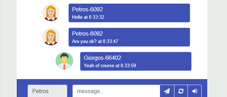

# Hybrid Chat Application

Arduino Distributed Chat is a project that consists of a web application, that enables the communication between users via chat by using a microcontroller for synchronization and messages storage.

## Table of Contents

[Description](#description)

[Technologies](#technologies)

[Getting Started](#getting-started)

[Execution](#execution)

[Screenshots](#screenshots)

[License](#license)

## Description

The whole infrastructure consists of the web application, that every user should have and the web server that is an Arduino based microcontroller. A microcontroller in this network can publish every message, that it receives.

Main benefits are involving:

* Low power consumption.
* Easy maintenance of web server.
* Low-cost infrastructure.

Single message information:

* The maximum length of ID is 4 characters: LI.
* The maximum length of the username is 8 characters: LU.
* The maximum length of a message is 35 characters: LM.
* Separators(~) amount is 3 characters: SA.
* The maximum length of message = LI + LU + LM + SA = 50 characters.S

## Technologies

1.	MQTT Broker: broker.hivemq.com, Port: 1883.
2.	Microcontroller: ESP8266.
3.	Web Application: HTML, CSS, Javascript, MQTT Paho Library, Bootstrap Library.
4.	Arduino IDE (PubSubClient Library for MQTT connection).

## Getting Started

### Download the Source of Project

Download repository code from:

``` https://github.com/georgealexakis/hybrid-chat-application.git (master branch) ```

Or get a copy of the source from:

``` $ git clone https://github.com/georgealexakis/hybrid-chat-application.git (master branch) ```

Run:

``` npm install ```

to install dependencies.

## Execution

### Hybrid Application

* In your browser: [https://georgealexakis.github.io/hybrid-chat-application/](https://georgealexakis.github.io/hybrid-chat-application/).
* Build the Hybrid Applications for different devices using Apache Cordova, Adode Phonegab for mobile devices. Rename /docs folder to /www folder before build.

### Microcontroller 

Upload the code distributed-chat.ino from the folder [/distributed-chat](https://github.com/georgealexakis/hybrid-chat-application/tree/master/distributed-chat) to the Wemos D1 mini microcontroller board.

### Usage Information

The user runs the application as a web page and does the following steps:

1. Enter the name.
2. Then press the login button (last from right).
3. The status becomes Online.
4. Text input is activated.
5. Enter the text and press the send button.
6. When the someone sends a message, the message will be send also to the sender to be sure that the message has been sent.

### Future Improvements

Usage of multiple microcontrollers, which will be synchronized with each other, in case of switch off when the next one is ready. Also, a future improvement will be the tasks sharing and user status caching between microcontrollers.

## Screenshots

### Communication of 3 Users




## License

This project is licensed under the MIT License - see the [LICENSE](LICENSE) file for details.